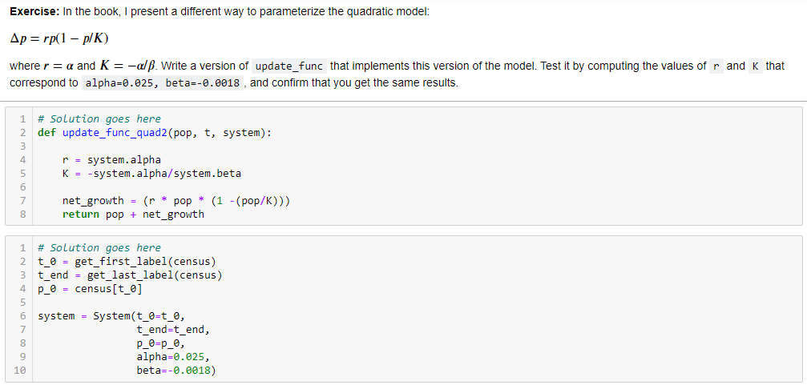

```{r setup, include=FALSE}
knitr::opts_chunk$set(echo = TRUE)
```


## 1. Explain the balance equations from the rainwater harvesting paper posted to this week's reading. 

This reading discuss the design of a Rainwater Harvesting (RWH) system in  non-parametric stochastic rainfall generator simulation.

**Balance Equations:**

1. Volume in the cistern on a given day(t)
$$
V_t = Max \{ 0, V_{t-1} + C_t - D_t - O_t\}
$$
2. Min/Max tank capacity
$$
V_t = Min\{Max( 0, V_{t_1} + C_t - D_t), Cap)\} 
$$
where (C) is captured supply of rainwater from the roof , (D) is demand for purified water , and (O) is overflow are the primary considerations for the volume (V) in the cistern. On any given day, indexed with t $\epsilon$ T, the volume in the cistern is expressed as shown in Equation (1). Note that t is a daily index.

Equation (2) illustrates a minimum/maximum approach for modeling tank capacity (Cap), which ignores the amount of overflow.

## 2. Share some code from last week that was particularly rewarding or frustrating.  We will comment on it.  



This was rewarding experience in this exercise. I like to we can store different attributes values in a variable System. For example: t_0, t_end etc and called by using `.` like system.alpha  
